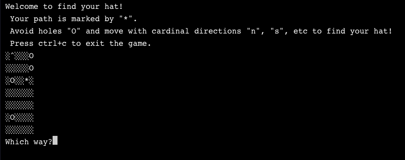

# Find Your Hat
*A terminal game*

## Description
Find your hat accepts user commands in the form of cardinal directions 
in order to navigate a randomly generated field. Players must avoid falling into 
randomly placed holes in order to find their hat '^'. 

## Technologies 
* Node.js

## Modules
* prompt-sync

## To-Do

* Clean up code and variable names
* Add path checker to ensure all randomly generated fields are solvable
* Update graphics with terminal-kit
* Modularise code for tidiness 
